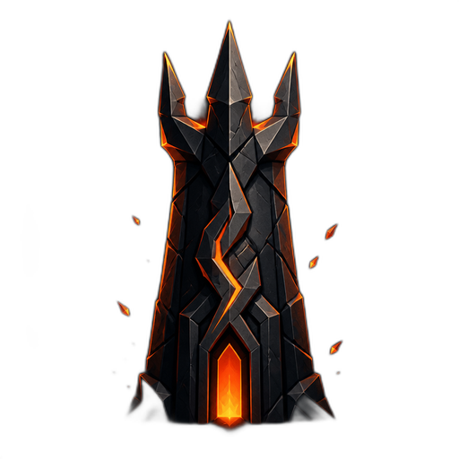

<p align="center">
  
</p>

<h1 align="center">Gitadel</h1>

<p align="center">
  <a href="LICENSE"></a>
  
  
</p>

Gitadel is a small self-hosted Git server for projects you want to keep, browse, and occasionally clone.

It keeps the useful parts of a forge without turning into another collaboration platform. Push over SSH, browse source and history in the web UI, and keep the whole instance in one portable data directory.

- Public and private repositories under `user-or-org/repository` namespaces
- SSH push and clone, public HTTP fetch, Git LFS, and LFS file locks
- Branches, tags, commit history, diffs, Markdown, syntax highlighting, and language statistics
- Passkeys, password sessions, API tokens, invitations, and per-repository access grants
- Integrity-checked offline backups for the database, repositories, LFS objects, and SSH host key

Gitadel deliberately leaves out pull requests, issues, social features, and in-browser editing.

## Run it

### Docker Compose

```bash
git clone https://github.com/Fractal-Tess/gitadel.git
cd gitadel
docker compose up --build
```

Open [http://localhost:3000/register](http://localhost:3000/register) to create the first administrator. SSH listens on port `2222`; application data lives in the `gitadel-data` volume.

Set the public URL and exposed ports when the defaults do not match your host:

```bash
GITADEL_PUBLIC_URL=https://git.example.com \
GITADEL_HTTP_PORT=3000 \
GITADEL_SSH_PORT=2222 \
docker compose up -d --build
```

TLS and internet-facing access belong at the reverse proxy. Gitadel serves HTTP and SSH directly but does not manage certificates.

### NixOS

Add the flake and enable the bundled module:

```nix
{
  inputs.gitadel.url = "github:Fractal-Tess/gitadel";

  outputs = { nixpkgs, gitadel, ... }: {
    nixosConfigurations.archive = nixpkgs.lib.nixosSystem {
      system = "x86_64-linux";
      modules = [
        gitadel.nixosModules.default
        {
          services.gitadel = {
            enable = true;
            package = gitadel.packages.x86_64-linux.default;
            publicUrl = "https://git.example.com";
            openFirewall = true;
          };
        }
      ];
    };
  };
}
```

The module stores persistent state in `/var/lib/gitadel` and runs Gitadel as a hardened systemd service.

## Create and push a repository

Create an API token with write access in **Settings**, then use the CLI:

```bash
export GITADEL_SERVER=https://git.example.com
export GITADEL_TOKEN=your-token
gitadel repo create archivist/old-project --private
```

Add the SSH key from your account settings and push an existing project:

```bash
git remote add archive ssh://git@git.example.com:2222/archivist/old-project.git
git push archive main
```

## Back up the instance

Backups are offline by design. Stop the server so the storage lock can guarantee one consistent snapshot:

```bash
docker compose stop gitadel
docker compose run --rm gitadel backup create /data/gitadel-backup.tar.zst
docker compose start gitadel
```

Each archive includes a SHA-256 manifest. Restore refuses changed, missing, or extra files and only writes into empty storage paths.

## Develop

The repository pins Bun, Rust, and native dependencies through devenv:

```bash
devenv shell
frontend-install
frontend       # SvelteKit on :5173
backend        # Gitadel on :3000, SSH on :2222
```

Build the production binary and embedded frontend with:

```bash
release-build
```

## License

[MIT](LICENSE)
